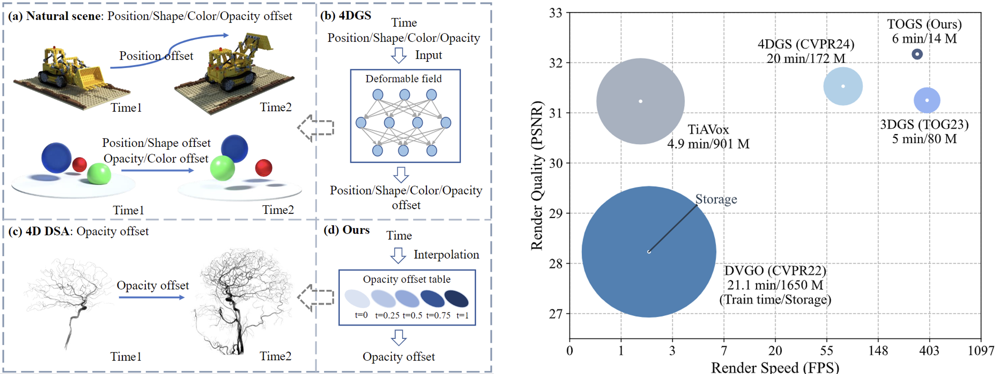

<div align="center">
<h1> TOGS: Gaussian Splatting with Temporal Opacity Offset for Real-Time 4D DSA Rendering</h1>


### [arXiv Paper](https://arxiv.org/abs/2403.19586)

[Shuai Zhang](https://github.com/Shuaizhang7) <sup>1</sup>, [Huangxuan Zhao](https://scholar.google.com.hk/citations?user=AaQm4aYAAAAJ&hl=zh-CN&oi=ao) <sup>3</sup>, [Zhenghong Zhou](https://github.com/zhouzhenghong-gt/) <sup>1</sup>, [Guanjun Wu](https://guanjunwu.github.io/) <sup>2</sup>,[Chuansheng Zheng](https://scholar.google.com.hk/citations?hl=zh-CN&user=abn37yYAAAAJ&view_op=list_works&sortby=pubdate) <sup>3</sup>,<br>
[Xinggang Wang](https://xwcv.github.io/) <sup>1</sup>,[Wenyu Liu](http://eic.hust.edu.cn/professor/liuwenyu) <sup>1,📧</sup>

<sup>1</sup> School of Electronic Information and Communications, Huazhong University of Science and Technology \
<sup>2</sup>  School of Computer Science &Technology, Huazhong University of Science and Technology \
<sup>3</sup> Department of Radiology, Union Hospital, Tongji Medical College, Huazhong University of Science and Technology 

(📧 corresponding author) 


---
<div align="left">

  
## Abstract



We propose TOGS, a Gaussian splatting method with opacity offset over time, which can effectively improve the rendering quality and speed of 4D DSA. We introduce an opacity offset table for each Gaussian to model the temporal variations in the radiance of the contrast agent. Additionally, we introduced a Smooth loss term in the loss function to mitigate overfitting issues that may arise in the model when dealing with sparse view scenarios. This model achieves stateof-the-art reconstruction quality under the same number of training views. Additionally, it enables real-time rendering while maintaining low storage overhead. 


## Installation

```
git clone https://github.com/hustvl/TOGS.git
conda create -n togs
conda activate togs
pip install -r requirements.txt
python ./submodules/diff-gaussian-rasterization/setup.py install
python ./submodules/simple-knn-main/setup.py install
```


## Training

### Dataset preparation


Organize medical data into a form similar to [D-NeRF](https://github.com/albertpumarola/D-NeRF).

1. Use the `./processing_data/get_image.py` script to extract image and angle information from DICOM data.
2. Use the `./processing_data/get_json.py` script to get transforms_train.json and transforms_test.json.

```
├── data
│   | medicaldata 
│     ├── imgname1.png
│     ├── imgname2.png
│     ├── imgname3.png
│     ├── imgname4.png
│     ├── ...
│     ├── transforms_train.json
│     ├── transforms_test.json
```


### Training

```bash
python train.py -s ./data/medicaldata --eval --yaml_file /data5/zhangshuai/TOGS/arguments/30.yaml
```

usage: python train.py -s [data path] --eval --yaml_file [configfile path]  (30: Number of training views)


### Rendering

```bash
python render.py -m ./output/30_2024-08-23_13:53:56
```

usage: python render.py -m [model save path]


### Evaluation

```bash
python metrics.py -m ./output/60_2024-01-01_21:36:19
```

usage: python metrics.py -m [model save path]

### Visualization

Number of training views: 30, testing views: 103, PSNR: 31.80.


## Acknowledgement

This project is built upon [3DGS](https://github.com/graphdeco-inria/gaussian-splatting).

## Citation
```latex
@article{zhang2024togs,
  title={TOGS: Gaussian Splatting with Temporal Opacity Offset for Real-Time 4D DSA Rendering},
  author={Zhang, Shuai and Zhao, Huangxuan and Zhou, Zhenghong and Wu, Guanjun and Zheng, Chuansheng and Wang, Xinggang and Liu, Wenyu},
  journal={arXiv preprint arXiv:2403.19586},
  year={2024}
}
```